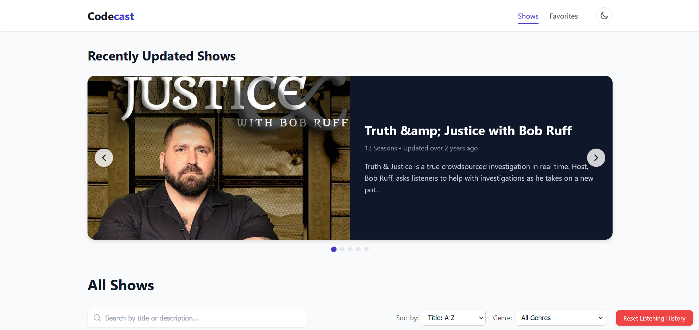

# CodeCast — Podcast Web Application

<div align="center">

[](https://www.typescriptlang.org/)
[](https://reactjs.org/)
[](https://github.com/pmndrs/zustand)
[](https://vitejs.dev/)
[](https://opensource.org/licenses/MIT)

**[View Live Application](https://codecastpod.netlify.app/)**

</div>

---

## About

CodeCast is a full-featured podcast streaming web application built with **React 18** and **TypeScript**. The project was developed to demonstrate production-grade frontend architecture — covering real-time audio playback, persistent state management, responsive design, and a clean component-driven codebase.

### What it does

- **Stream podcasts** from a live REST API — browse hundreds of shows, seasons, and episodes
- **Advanced audio player** — playback speed control, sleep timer, keyboard shortcuts, and auto-resume from where you left off
- **Smart search** — fuzzy matching with Levenshtein distance tolerates typos and partial input
- **Favourites & history** — save episodes, track progress, and reset listening history with a single click
- **Themes** — light/dark mode with system preference detection

### Why it's built the way it is

State is managed with **Zustand** split into four isolated stores (`playerStore`, `showsStore`, `favoritesStore`, `themeStore`) — keeping concerns separated and updates performant. Audio is handled through a singleton service wrapping the HTML5 Audio API, ensuring one consistent playback engine across all routes. All user preferences are persisted in `localStorage` with no backend required.



---

## Quick Start

### Live Demo

[https://codecastpod.netlify.app/](https://codecastpod.netlify.app/)

### Run Locally

```bash
# Clone the repository
git clone https://github.com/MorenaDlamini/codecast.git
cd codecast

# Install dependencies
npm install

# Start development server
npm run dev
```

Open [http://localhost:5173](http://localhost:5173) in your browser.

### Available Scripts

| Command | Description |
|---------|-------------|
| `npm run dev` | Start local development server |
| `npm run build` | Type-check and compile for production |
| `npm run preview` | Preview the production build locally |
| `npm run lint` | Run ESLint across all TypeScript files |

---

## Features

### Audio Player
- Play, pause, skip forward/backward (15s increments)
- Adjustable playback speed (0.5x – 2.0x)
- Volume control with mute toggle
- Keyboard shortcuts: `Space` play/pause · `←/→` skip · `M` mute · `N/P` next/prev
- Sleep timer for auto-stop after a set duration
- Progress saved automatically — resumes where you left off
- Persistent playback while navigating between pages

### Content Discovery
- Real-time fuzzy search using Levenshtein distance — tolerates typos and partial matches
- Genre filtering with one-click category selection
- Sort shows: A–Z, Z–A, most recently updated, oldest updated
- Interactive carousel for featured and recently added content
- Visual indicators for in-progress and completed episodes

### User Experience
- Light/dark theme — auto-detects system preference, supports manual override
- Favourites system — save specific episodes and revisit them anytime
- Full listening history with progress indicators
- Responsive layout across mobile, tablet, and desktop
- Close-tab warning when audio is actively playing

### Data & Persistence
- All podcast data fetched live from a REST API — nothing hardcoded
- Favourites and listening history persisted in `localStorage`
- One-click history reset option
- Session storage for current playback session state

---

## Architecture

### Data Flow

```
┌─────────────────┐      ┌─────────────────┐      ┌─────────────────┐
│                 │      │                 │      │                 │
│  UI Components  │◄────►│  Zustand Stores │◄────►│    Services     │
│                 │      │                 │      │                 │
└─────────────────┘      └─────────────────┘      └─────────────────┘
        ▲                                                 ▲
        │                                                 │
        ▼                                                 ▼
┌─────────────────┐                              ┌─────────────────┐
│  Custom Hooks   │                              │  Local Storage  │
└─────────────────┘                              └─────────────────┘
```

### State Management

Built on [Zustand](https://github.com/pmndrs/zustand) with four isolated stores:

| Store | Responsibility |
|-------|---------------|
| `playerStore` | Playback state, queue, volume, progress tracking |
| `showsStore` | Podcast catalog, genre data, search and filter logic |
| `favoritesStore` | Saved episodes, listen history, sort preferences |
| `themeStore` | Light/dark mode preference |

---

## Project Structure

```
codecast/src/
├── App.tsx                     # Root component with routing
├── main.tsx                    # Application entry point
├── components/
│   ├── AudioPlayer/            # Playback controls and queue UI
│   ├── EpisodeList/            # Episode browsing per season
│   ├── FavoritesList/          # Saved episodes view
│   ├── Filters/                # Genre filter controls
│   ├── SearchFilter/           # Fuzzy search input
│   ├── SeasonList/             # Season selection per show
│   ├── ShowCard/               # Show preview card
│   ├── ShowCarousel/           # Featured content slider
│   ├── ThemeToggle/            # Light/dark mode switch
│   └── ui/Loading/             # Loading state indicators
├── hooks/
│   └── useAudioService.ts      # Audio player integration hook
├── layouts/
│   └── MainLayout.tsx          # App shell and navigation
├── pages/
│   ├── Home.tsx                # Landing page
│   ├── Show.tsx                # Show detail page
│   ├── Season.tsx              # Season detail page
│   ├── Favorites.tsx           # Favourites page
│   └── NotFound.tsx            # 404 page
├── services/
│   ├── api.ts                  # REST API data fetching
│   ├── audioService.ts         # HTML5 audio engine
│   └── storage.ts              # localStorage abstraction
├── store/
│   ├── playerStore.ts
│   ├── showsStore.ts
│   ├── favoritesStore.ts
│   └── themeStore.ts
├── types/
│   └── index.ts                # TypeScript type definitions
└── utils/
    ├── dateUtils.ts            # Human-readable date formatting
    └── searchUtils.ts          # Fuzzy matching algorithm
```

---

## Technical Highlights

### Audio Engine

Built on the HTML5 Audio API with a singleton service pattern — one audio element shared across the entire app, driven by DOM events feeding into Zustand state:

```typescript
const audioService = {
  loadEpisode: (audioUrl: string, startTime = 0, autoplay = false) => {
    audioElement.src = audioUrl;
    audioElement.currentTime = startTime;
    if (autoplay) audioElement.play();
  },
  play: () => audioElement.play().catch(handlePlaybackError),
  pause: () => audioElement.pause(),
  seek: (time: number) => { audioElement.currentTime = time; },
  setVolume: (volume: number) => { audioElement.volume = volume; },
  setPlaybackRate: (rate: number) => { audioElement.playbackRate = rate; }
};
```

Progress is auto-saved every 10 seconds and restored on the next visit.

### Fuzzy Search

Uses a Levenshtein distance algorithm with weighted scoring — title matches rank higher than description matches:

```typescript
const searchShows = (shows: Show[], query: string) => {
  const lowerQuery = query.toLowerCase();
  return shows
    .filter(show => {
      const titleScore = fuzzyMatch(show.title.toLowerCase(), lowerQuery);
      const descScore = fuzzyMatch(show.description.toLowerCase(), lowerQuery) * 0.5;
      return Math.max(titleScore, descScore) > 0.6;
    })
    .sort((a, b) =>
      fuzzyMatch(b.title.toLowerCase(), lowerQuery) -
      fuzzyMatch(a.title.toLowerCase(), lowerQuery)
    );
};
```

### Responsive Breakpoints

| Breakpoint | Target | Layout |
|------------|--------|--------|
| < 576px | Mobile | Single column, condensed controls |
| 576–768px | Large phones / small tablets | Two-column grid |
| 768–992px | Tablets / small laptops | Three-column grid, full player |
| > 992px | Desktop | Four-column grid, extended features |

Fluid typography via CSS `clamp()`, dynamic grid columns via `auto-fit` + `minmax`.

---

## Tech Stack

| Category | Technology |
|----------|-----------|
| UI Framework | React 18 |
| Language | TypeScript 5 |
| State Management | Zustand 4 |
| Routing | React Router 6 |
| Build Tool | Vite 4 |
| Styling | CSS Modules |
| Date Formatting | date-fns |
| Immutable Updates | Immer |
| Deployment | Netlify |

---

## Roadmap

### In Progress
- Improved mobile audio controls
- Keyboard shortcut reference panel

### Planned
- User authentication and personal profiles
- Cross-device sync via cloud storage
- Podcast subscription and new episode notifications
- Offline listening with service worker caching
- Personalized recommendations based on listening history

---

## API Reference

Data is sourced from a public podcast API:

| Endpoint | Returns |
|----------|---------|
| `https://podcast-api.netlify.app` | Array of show previews |
| `https://podcast-api.netlify.app/id/<ID>` | Full show with seasons and episodes |
| `https://podcast-api.netlify.app/genre/<ID>` | Genre metadata |

---

## Development Setup

See [dependencies.txt](./dependencies.txt) for a full list of dependencies and install instructions.

**Recommended VS Code extensions:**
- ESLint
- Prettier
- TypeScript Error Translator
- React Developer Tools (browser extension)

---

<div align="center">

Built by [Morena Dlamini](https://github.com/MorenaDlamini)

[GitHub](https://github.com/MorenaDlamini) · [Live Site](https://codecastpod.netlify.app/)

</div>
